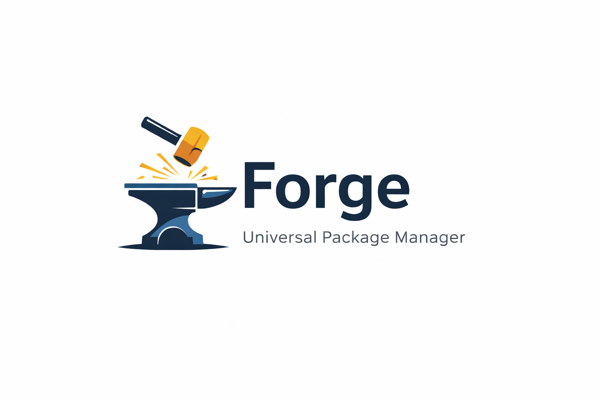

[](https://cloudsmith.com)



# Forge

A universal package manager that forges packages across different ecosystems (Node, Python, Maven, etc.) into a single, unified experience.

## Vision

Forge provides a single, consistent interface for managing packages across multiple programming language ecosystems, while maintaining compatibility with existing package formats and registries.

## Project Goals

1. **Universal Interface**: One command-line tool to manage packages across all supported ecosystems
2. **Format Compatibility**: Support existing package formats without requiring changes to existing packages
3. **Registry Flexibility**: Work with existing registries (npmjs.com, PyPI, Maven Central) and private registries
4. **Dependency Resolution**: Intelligent dependency resolution across different package formats
5. **Performance**: Fast package installation and dependency resolution
6. **Extensibility**: Plugin architecture for adding new package format support

## Supported Package Formats

- [x] **Node** (Node.js) - ✅ **IMPLEMENTED** - package.json, dependency resolution, registry integration
- [x] **Python** (Python) - ✅ **IMPLEMENTED** - requirements.txt, PyPI integration, dependency resolution
- [ ] **maven** (Java) - 🚧 Planned - pom.xml, .m2 repository
- [ ] **gradle** (Java/Android) - 🚧 Planned - build.gradle, build.gradle.kts
- [ ] **cargo** (Rust) - 🚧 Planned - Cargo.toml
- [ ] **composer** (PHP) - 🚧 Planned - composer.json
- [ ] **gem** (Ruby) - 🚧 Planned - Gemfile
- [ ] **go modules** (Go) - 🚧 Planned - go.mod
- [ ] **nuget** (.NET) - 🚧 Planned - .csproj, packages.config
- [ ] **cocoapods** (iOS) - 🚧 Planned - Podfile

## Architecture Overview

```
┌─────────────────────┐
│   Forge CLI Core      │
├─────────────────────┤
│  Command Parser     │
│  Config Manager     │
│  Registry Client    │
└─────────────────────┘
           │
┌─────────────────────┐
│  Plugin System      │
├─────────────────────┤
│  node Plugin        │
│  python Plugin      │
│  maven Plugin       │
│  [...more plugins]  │
└─────────────────────┘
           │
┌─────────────────────┐
│   Core Services     │
├─────────────────────┤
│  Dependency Resolver│
│  Download Manager   │
│  Cache System       │
│  Lock File Manager  │
└─────────────────────┘
```

## Development Phases

### Phase 1: Foundation & Research ✅ COMPLETE
- [x] Research existing package manager implementations
- [x] Define core architecture and interfaces
- [x] Set up project structure
- [x] Create basic CLI framework

### Phase 2: First Package Format (node) ✅ COMPLETE
- [x] Implement node package.json parsing
- [x] Basic node registry interaction
- [x] Dependency resolution with transitive dependencies
- [x] Package download and caching system
- [x] Search and package info functionality

### Phase 3: Core Features ✅ COMPLETE
- [x] Configuration management
- [x] Caching system
- [x] Error handling and logging
- [x] Dry-run functionality

### Phase 4: Additional Formats ✅ IN PROGRESS
- [x] Python support - ✅ **IMPLEMENTED**
- [ ] Java maven support
- [ ] Add more formats iteratively

### Phase 5: Advanced Features 🚧 PLANNED
- [x] Actual package installation (beyond dry-run)
- [x] Lock file generation and management
- [x] Cross-format dependency resolution
- [ ] Registry mirroring
- [ ] Security scanning
- [ ] Performance optimizations

## Getting Started

### Installation

#### Release Artifacts

Each release includes the following artifacts:

| File | Platform | Description |
|------|----------|-------------|
| `forge-macos-x64` | macOS Intel | Standalone binary for Intel Macs |
| `forge-macos-arm64` | macOS Apple Silicon | Standalone binary for M1/M2/M3 Macs |
| `forge-linux-x64` | Linux x64 | Standalone binary for Linux |
| `forge-linux-arm64` | Linux ARM64 | Standalone binary for Linux ARM (Raspberry Pi, etc.) |
| `forge-win-x64.exe` | Windows x64 | Standalone executable for Windows |
| `forge_x.x.x_amd64.deb` | Debian/Ubuntu x64 | Debian package for apt-based systems |
| `forge_x.x.x_arm64.deb` | Debian/Ubuntu ARM64 | Debian package for ARM systems |
| `forge-x.x.x-macos-x64.pkg` | macOS Intel | macOS installer package |
| `forge-x.x.x-macos-arm64.pkg` | macOS Apple Silicon | macOS installer package |
| `forge.x.x.x.nupkg` | Windows | Chocolatey package |

#### macOS

```bash
# Option 1: Direct download (Apple Silicon)
curl -L https://dl.cloudsmith.io/public/ranjantestenv/forge/raw/names/forge-macos-arm64/versions/latest/forge-macos-arm64 -o /usr/local/bin/forge
chmod +x /usr/local/bin/forge

# Option 2: macOS Installer (.pkg)
# Download forge-x.x.x-macos-arm64.pkg from GitHub Releases and double-click to install

# Option 3: Homebrew (coming soon)
# brew install forge
```

#### Linux

```bash
# Option 1: Debian/Ubuntu (.deb)
curl -LO https://dl.cloudsmith.io/public/ranjantestenv/forge/deb/pool/any-distro/any-version/main/f/fo/forge_0.1.0_amd64.deb
sudo dpkg -i forge_*.deb

# Option 2: Direct download
curl -L https://dl.cloudsmith.io/public/ranjantestenv/forge/raw/names/forge-linux-x64/versions/latest/forge-linux-x64 -o ~/.local/bin/forge
chmod +x ~/.local/bin/forge
```

#### Windows

```powershell
# Option 1: Chocolatey
choco install forge --source="https://nuget.cloudsmith.io/ranjantestenv/forge/v2/"

# Option 2: Direct download
Invoke-WebRequest -Uri "https://dl.cloudsmith.io/public/ranjantestenv/forge/raw/names/forge-win-x64.exe/versions/latest/forge-win-x64.exe" -OutFile "$env:LOCALAPPDATA\forge.exe"
```

#### npm (requires Node.js)

```bash
npm install -g forge --registry=https://npm.cloudsmith.io/ranjantestenv/forge/
```

#### From Source

```bash
git clone https://github.com/DRYRunOnly/Forge.git
cd Forge
npm install
npm run build
npm install -g .

### Using Forge in a new directory (no package.json)

Forge can be used in a completely fresh directory, similar to npm:

```bash
mkdir my-app && cd my-app
forge install lodash
```

- If there is **no** `package.json` or other manifest, Forge will:
    - Default to the Node plugin (by pluginPriority) when you specify packages.
    - Create `node_modules/` and install the requested packages.
    - Generate a Forge-managed `forge-node-lock.json` (Forge-specific schema, not npm's).
- Forge does **not** create or modify `package.json` for you; manifests remain under your control.

# Install globally (optional)
npm install -g .

# Now you can use 'forge' anywhere
forge --help
```

### Usage

```bash
# Help
forge --help

# Search for packages
forge search lodash

# Get package information
forge info express

# Install packages (dry-run)
forge install --dry-run -v

# Install specific packages (dry-run)
forge install lodash express --dry-run

# Format override examples (mixed projects)
forge install --format node lodash    # Force node in mixed project
forge install --format python requests  # Force python in mixed project
forge remove --format python django  # Remove with specific format
forge update --format node           # Update with specific format

# Remove packages
forge remove lodash

# List installed packages
forge list

# Configuration management
forge config list
forge config get cache.directory
forge config set cache.maxSize 2GB
forge config get pluginPriority
forge config set-priority "python,node,maven"  # Set plugin detection priority
```

### Current Features

✅ **Universal CLI Interface**: Single command-line tool for multiple package formats  
✅ **node Support**: Full node registry integration with dependency resolution  
✅ **python Support**: Python package management with PyPI integration  
✅ **Format Override**: `--format` flag to force specific plugin (node, python, javascript, nodejs)  
✅ **Configurable Plugin Priority**: Customize auto-detection order (node-first vs python-first)  
✅ **Smart Dependency Resolution**: Handles complex transitive dependencies (node) and shallow resolution (python)  
✅ **Mixed Project Support**: Handle projects with multiple package formats  
✅ **Package Search**: Search across supported registries  
✅ **Caching System**: Downloaded packages cached for reuse  
✅ **Configuration Management**: Multi-source configuration with plugin priority settings  
✅ **Alphabetical CLI**: Commands and options sorted alphabetically for consistency  
✅ **Dry-run Mode**: Preview operations before execution  
✅ **Error Handling**: Comprehensive error reporting  
✅ **Logging System**: Verbose logging for debugging  

This project is in active development. Both node and python plugins are functional for dependency resolution, search, and package information. Installation is currently in dry-run mode.

## Contributing

We welcome contributions! Please see our contribution guidelines:

- 📋 [Contributing Guide](CONTRIBUTING.md) - Development setup, coding standards, and contribution process
- 👥 [Maintainers](MAINTAINERS.md) - Project maintainers and contact information
- 🔒 [Security Policy](SECURITY.md) - Reporting security vulnerabilities
- 📝 [Changelog](CHANGELOG.md) - Project history and release notes

### Quick Start for Contributors

```bash
# Fork and clone the repository
git clone https://github.com/DryRunOnly/Forge.git
cd forge

# Install dependencies and build
npm install
npm run build

# Run tests
npm test

# Start developing
npm run dev
```

For detailed information, please read our [Contributing Guide](CONTRIBUTING.md).

## Hosting

[](https://cloudsmith.com)

Package repository: [cloudsmith.io/~ranjantestenv/repos/forge](https://cloudsmith.io/~ranjantestenv/repos/forge/)

## License

This project is licensed under the [MIT License](LICENSE).
